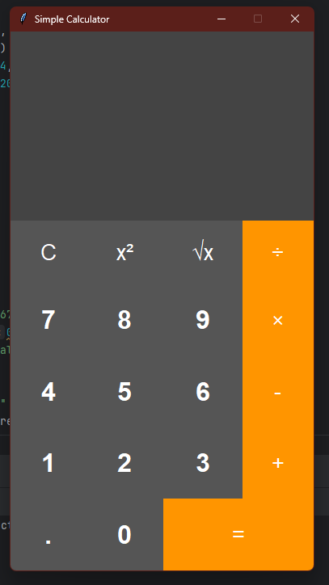

# Basic Calculator with Tkinter

Experience the simplicity of our basic calculator application, crafted using Python and Tkinter, a widely-used Python GUI library.

## Features

🧮 Effortlessly perform arithmetic operations, including addition, subtraction, multiplication, and division.

🔍 Utilize decimal numbers for precision in your calculations.

🔄 Reset your input with a single click using the convenient clear button.

## System Requirements

To use this calculator, ensure you have the following:

- Python 3.x installed on your system.
- Tkinter, a standard component often bundled with Python installations.

## Screenshot

📸 Here's a visual preview of our calculator application.
